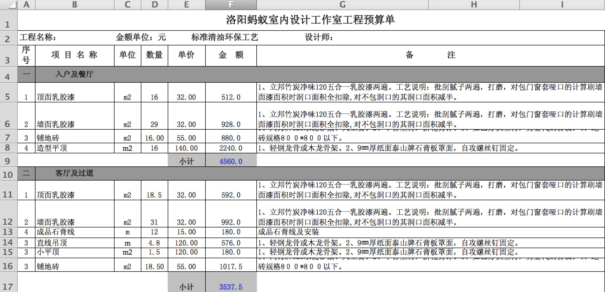
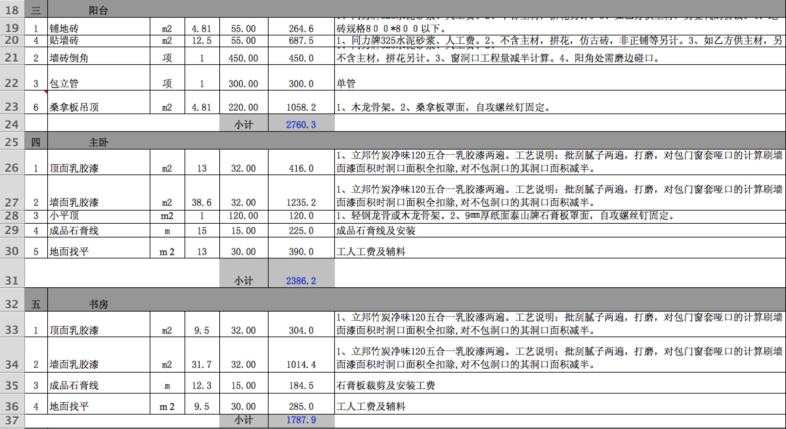
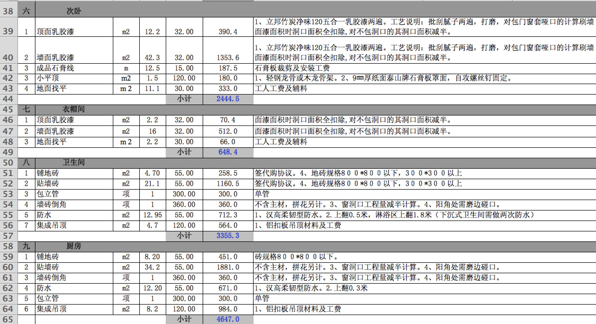
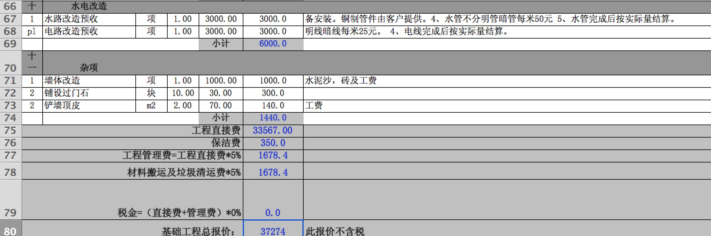

## 吉庆 预算缺项

- 水电改造 （6000）详细
	- 水管 50*60米
	- 电路 25*120米 
	- custom 料2000  工钱3500  
- 防水 55＊25/平米 = 1375
	- custom 包工料 1200   30/平米
- 铺砖 (工钱＋水泥沙子+包管子＋过门石) 约等于10490 铺砖55没平米
	- 包管子 3*300=900
	- custom 8000(工钱、水泥沙子、包管子、过门石)＋ 10000的砖钱   
- 砌墙 （8320）
	- custom 5100
- 集成吊顶 5602.2
	- 2996 客厅餐厅
	- 2606.2 厨房、卫生间、阳台 
	- custom 4吊顶 2700 （包含灯） 
- 贴石膏线 15*39.8/米 ＝ 595
	- custom 5*100 ＝ 500 

----
## 缺的项
- 水电暖线的线 
- 洗衣房砌池子
- 卫生间洗漱池子 （砌或买）
- 卫生间 隔断的处理
- 插座开关 (自备) 
- 晾衣服架 (安装自备)
- 装灯 (自备)
- 窗户套 
- 小阳台 铲外保温层
- 封阳台

##预算报价如下

---

	