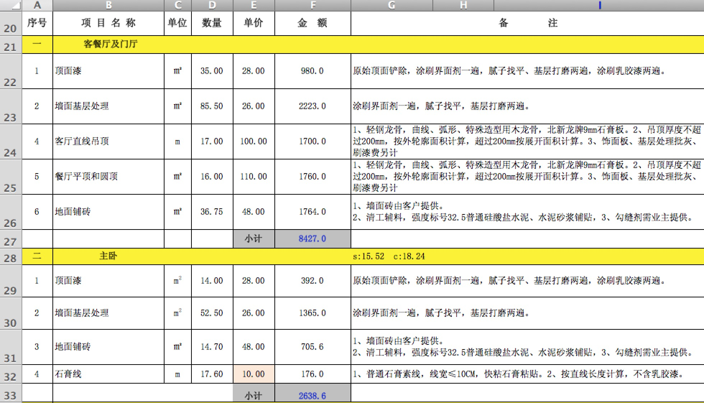

## 李玺 预算缺项

- 水电改造 （7380）详细 
	- custom 料2000  工钱3500  
- 防水 1200
	- custom 包工料 1200   30/平米
- 铺砖 (工钱＋水泥沙子+包管子＋过门石) 约等于9000
	- 包管子 3*400=1200
	- custom 8000(工钱、水泥沙子、包管子、过门石)＋ 10000的砖钱   
- 砌墙 （8800）？？？
	- 墙面处理 6800 
	- 乳胶漆 2000
	- custom 工钱2000+1000料 
		- 墙纸 2100 
- 集成吊顶 ？？
	- custom 4吊顶 2700 （包含灯） 
- 贴石膏线 10*100 ＝ 1000
	- custom 5*100 ＝ 500 

----
## 缺的项
- 水电暖线的线 
- 洗衣房砌池子
- 卫生间洗漱池子 （砌或买）
- 卫生间 隔断的处理
- 插座开关 (自备) 
- 晾衣服架 (安装自备)
- 装灯 (自备)
- 窗户套 
- 小阳台 铲外保温层
- 封阳台

## 多的项

- 客厅餐厅吊顶 3500

##预算报价如下

---

主材如下

	