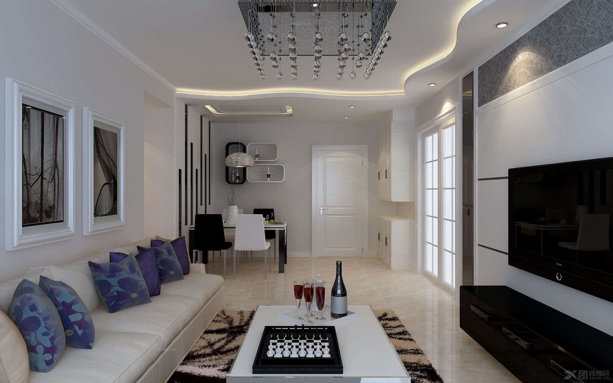
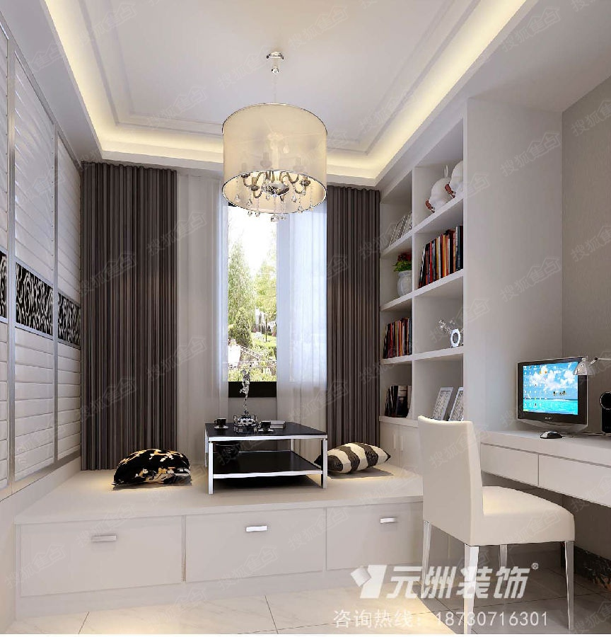

## 问题 风格一（米棕）

- 客厅和餐厅都没柜子 不实用
- 屏风不好看
- 吊顶太复杂 预算比较高（觉得没这个必要）
- 色系偏暗
- 吊柜和桌子 不实用
- 玄关过于简单 有点浪费 
- 效果图里没有放饮水机和 放挂暖的位置
- 电视墙不喜欢 不要这么复杂 还是以实用为准；电视墙要弱化 采用（柜子中间 放电视）这种方式
- 主卧室不满意 太复杂效果不好 飘窗柜在哪里，卧室不需要这么复杂，不需要吊顶 颜色以明亮温暖为主
- 书房 书柜的厚度太薄，书桌太小  或参考之前发过的榻榻米的图 参考网址：http://gangwanjz.github.io/websites/house/book/docs/design/refer.html 

## 风格二 (青绿色)

- 风格 容易不耐用 窗外愿景整不出 窗外田园的效果
- 餐厅还是需要个吊柜或者柜子，玻璃柱子的效果墙不喜欢 
- 玄关倒是还可以
- 榻榻米背景墙换壁纸 （简单大方的）或者挂画装饰
- 电视墙需要柜子 实用为准
- 饮水机 挂暖问题
- 卧室 整体的颜色不喜欢 回头给找参考图 

### 满意的

- 客厅餐厅的吊顶
- 沙发后面背景墙的装饰
- 榻榻米柜子和床是满意 （床不需要突出的活动桌）

## 说明

- 喜欢下图2的 色系 包含吊顶 餐厅的壁柜 和电视墙以及电视墙旁边的柜子 以及沙发茶几的色调
- 喜欢下图1的玄关 和吊顶
- 喜欢下图3 榻榻米的整体实用方式  大格子的书柜包含榻榻米的床 

喜欢的效果

---

