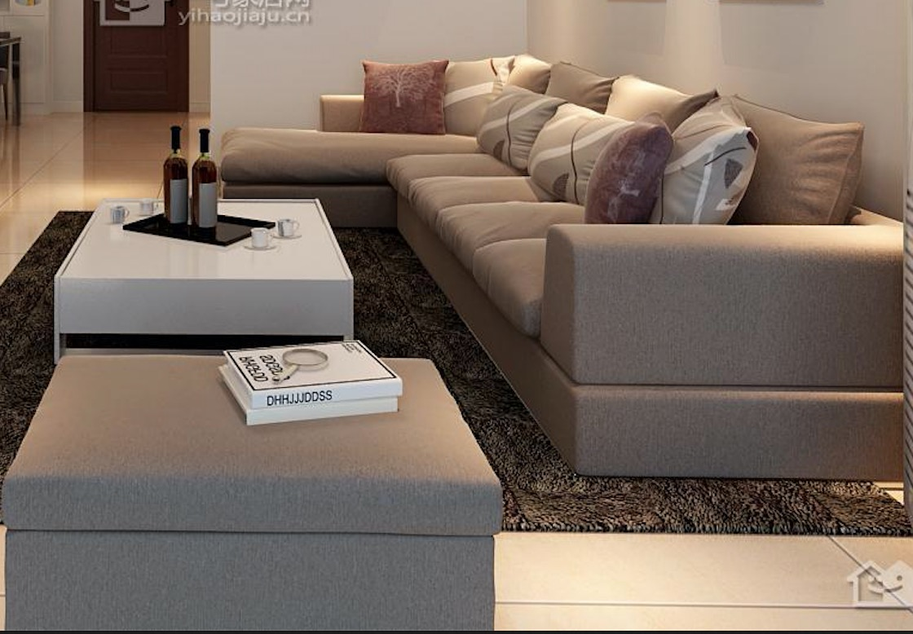

## 风格1(清新绿)

- 餐厅的椅子不怎么喜欢
- 屏风喜欢风格2的
- 沙发的颜色需要加深一点 布局调整一下 进门感觉会堵
- 榻榻米整个使用风格喜欢布局2的 (主要是床和书柜)
- 卧室 墙纸喜欢暖一点 简单一点的

## 风格2(米棕色)

- 客厅电视柜 吊柜还需要加 跟风格1的布局和数量相似
- 客厅的灯不太喜欢 再简约一点
- 沙发的颜色调整一下 如下

- 餐厅客厅的吊顶 使用风格1的吊顶 玄关和餐厅划分比较清晰

- 玄关的柜子需要调整一下(中间的空档再高一些)
- 书房这样就ok
- 卧室 窗户像风格1一样(尽量多的采光) 灯再简约一点 

