## 自己对装修的一些想法

* 空调不着急装 客厅一个柜机+卧室挂机 前期留好洞就ok
* 水电暖改造的时候 还要加一个线[网线(千兆的)] 卧室 书房 客厅都走

### 客厅餐厅
    * 不吊顶 走类似于[图1]的石膏线
    * 墙体的颜色为白色或乳白 效果类似于[图2]
    * 地砖 类似于[图1]
    * 餐厅 参考[图1]的效果;左墙的装饰\灯\墙柜 和 餐桌一套
    * 入户玄关 参考 [玄关图]
    * 客厅 沙发茶几地毯 喜欢[图2]的效果
    * 电视墙 贴壁纸搞定类似[图2]
    * 电视墙希望做出[图3]的布局效果 装饰+电视/电视柜+柜子+空调柜机 (电视柜不需要电视上方的横栏)
    * 厨房方向的门 卫生间入口 不需要门 考虑用什么样的门好看??*这个需要讨论*
    * 大阳台需要晾衣服 是否要做柜子??*这个也需要讨论*
   
 图1
 
 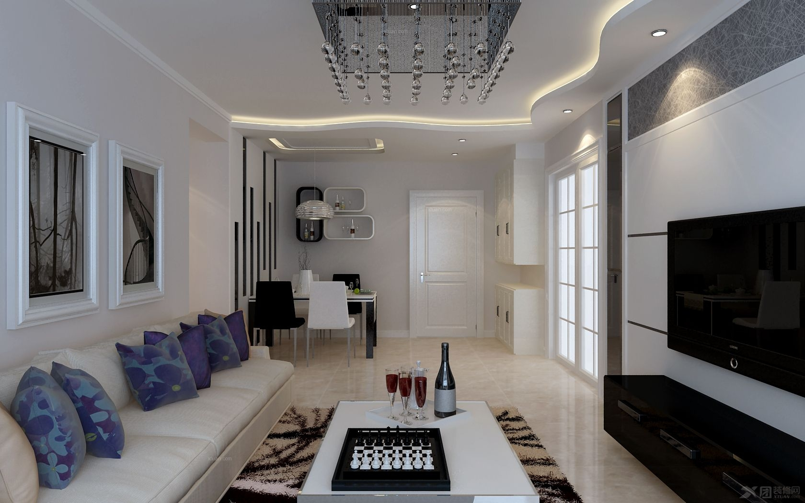
 
 图2
 
 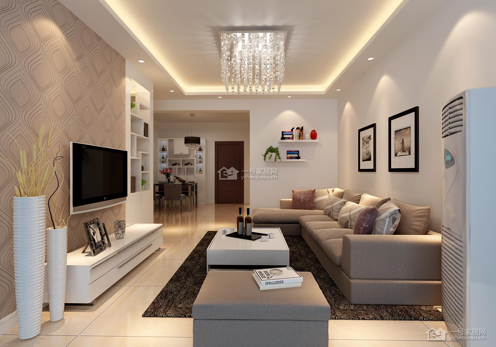
 
 图3
 
 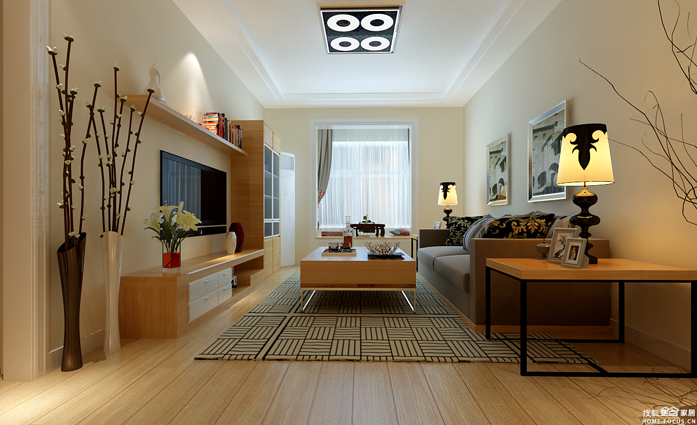
 
 图玄关
 
 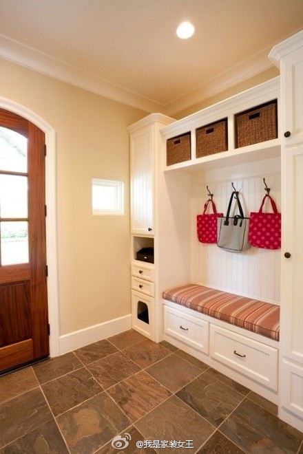    
   
### 厨房
    * 冰箱放在厨房 双开门的 *需要补具体大小*
    * 推荐一张图片[图厨房] 喜欢该图的颜色搭配 *需要考虑是否与客厅一致*
    * 热水器 管子 是否可以放在小阳台 *需要确认和讨论*
 
 图厨房
    
 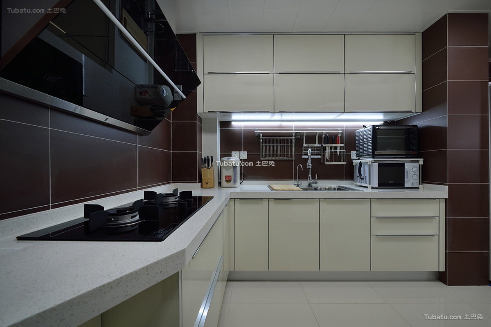   
    
### 小阳台
    * 放洗衣 扣水池 
    * 阳台封起来 留窗户
    * 推荐布局图 [图小阳台1][图小阳台2]
  
 图小阳台   
    
 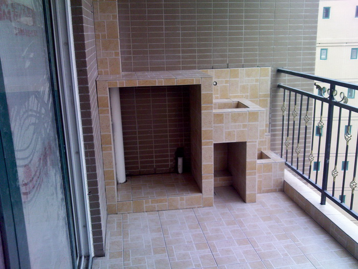
 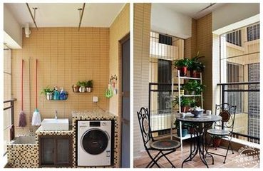
    
### 卫生间
    * 干湿分离
    * 马桶和洗澡间 是否可以做成这样 如图[图洗澡间1]
    * 或者 如[图洗澡间2]也不错
    
 图洗澡间
 
 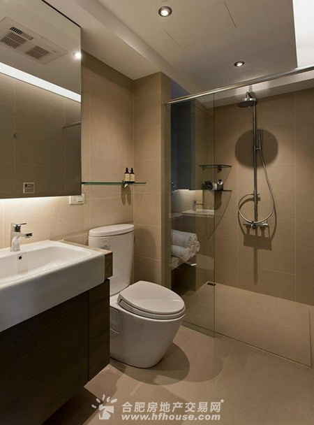
 
 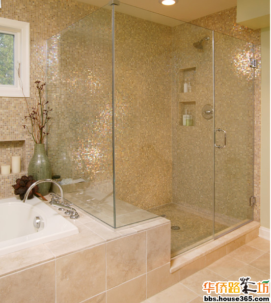   
    
### 书房
    * 打榻榻米 超喜欢这张图[图书房]
 
 图书房
 
 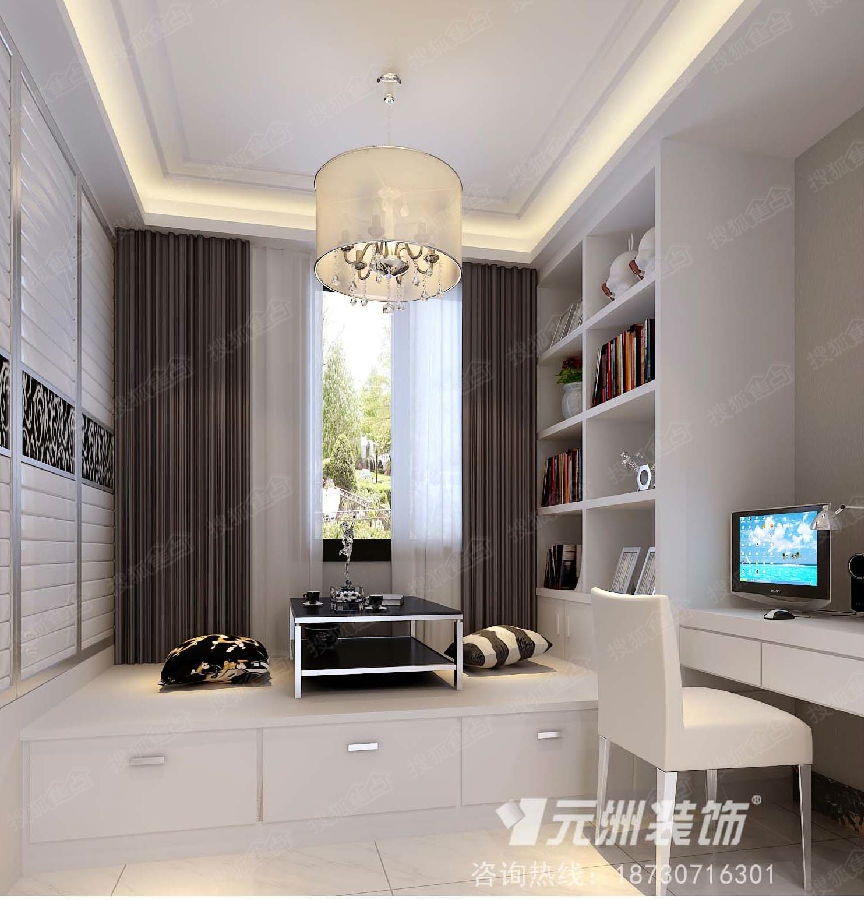   
    
### 衣帽间
    * 附2张图吧 考虑的较少
 
 图衣帽间
 
 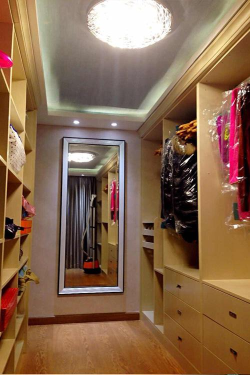 
   
 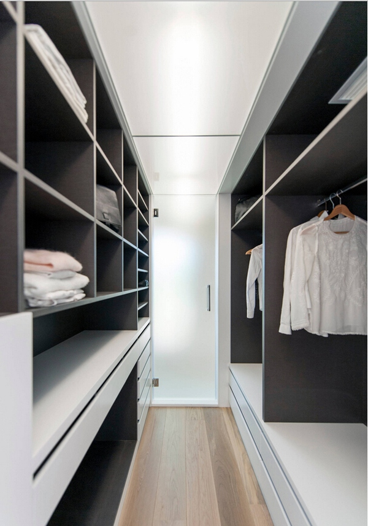   
    
### 柜子
    * 这个图 挺赞的不知道能不能用的上 [图柜子]
 
 图柜子 喜欢这个侧边的收容
 
 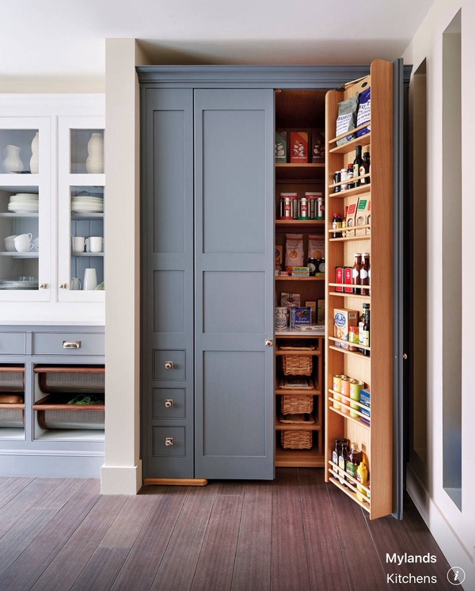   
    
### 主卧
    * 希望与客厅有不一样的感觉 
    * 能做个飘窗就更棒了
    * 图片待补充...
### 次卧
    * 次卧和主卧的风格不要一致
    * 简单就ok
    * 图片待补充...
### 具体插座开关怎么留 
    详细尺寸 后再附加吧    
    
### other 一些好东西的补充
   * 厨宝
   * 不要水晶灯  
    